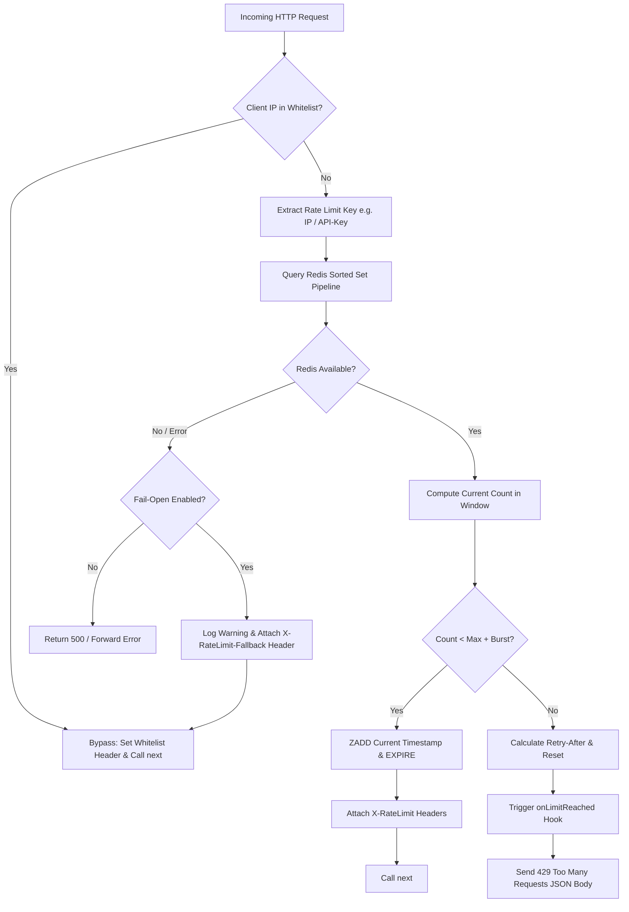

# api-rate-limiter-redis

> Production-ready sliding-window rate limiter middleware for Node.js and Express, powered by Upstash Serverless Redis sorted sets.

[](LICENSE)
[](https://nodejs.org)
[](https://upstash.com)

`api-rate-limiter-redis` provides enterprise-grade API rate limiting designed specifically for distributed, serverless, and traditional Node.js environments. By utilizing Redis sorted sets (`ZADD`, `ZREMRANGEBYSCORE`, `ZCARD`), it eliminates the common "double limit" boundary spike flaws found in standard fixed-window rate limiters.

---

## Table of Contents

- [Key Features](#key-features)
- [How It Works: Sliding Window Algorithm](#how-it-works-sliding-window-algorithm)
- [Architecture & Request Lifecycle](#architecture--request-lifecycle)
- [Installation](#installation)
- [Upstash Redis Setup Guide](#upstash-redis-setup-guide)
- [Quick Start](#quick-start)
- [Usage Examples](#usage-examples)
  - [1. Global Rate Limiting](#1-global-rate-limiting)
  - [2. Per-Route Sensitive Endpoints (e.g., Login / Auth)](#2-per-route-sensitive-endpoints-eg-login--auth)
  - [3. Custom Key Extraction (API Keys, User IDs, Orgs)](#3-custom-key-extraction-api-keys-user-ids-orgs)
  - [4. IP Whitelisting (Exact IPs & CIDR Subnets)](#4-ip-whitelisting-exact-ips--cidr-subnets)
  - [5. Standalone Check Pattern (WebSockets / tRPC / Serverless)](#5-standalone-check-pattern-websockets--trpc--serverless)
- [HTTP Response Headers](#http-response-headers)
- [Configuration Reference](#configuration-reference)
- [Fail-Open Resilience Strategy](#fail-open-resilience-strategy)
- [License](#license)

---

## Key Features

- **True Sliding Window Algorithm**: Accurate request rate calculation using Redis sorted sets. Prevents traffic bursts at window boundaries.
- **Upstash Serverless Redis Native**: Works seamlessly over HTTP/REST via `@upstash/redis`, making it ideal for AWS Lambda, Vercel, Cloudflare Workers, Render, and standard Node.js servers.
- **Burst Tolerance**: Configure an allowable temporary burst percentage (e.g., 10%) above the hard cap to prevent abrupt edge-case rejections during brief spikes.
- **CIDR & Subnet Whitelisting**: Full support for single IP addresses as well as IPv4 CIDR blocks (e.g. `10.0.0.0/8`, `192.168.0.0/16`, `127.0.0.1`).
- **Flexible Key Generation**: Rate limit by IP, Bearer Token, API Key, User ID, or custom request attributes.
- **RFC-Compliant Headers**: Automatically emits `X-RateLimit-Limit`, `X-RateLimit-Remaining`, `X-RateLimit-Reset`, and `Retry-After`.
- **Fail-Open Resilience**: Gracefully permits traffic if Redis experiences network degradation or downtime, protecting uptime over rate limiting.
- **Dual-Mode Operation**: Use as standard Express middleware or invoke `.check()` / `.reset()` programmatically in any async framework.

---

## How It Works: Sliding Window Algorithm

Traditional **fixed-window** limiters divide time into rigid buckets (e.g., 12:00 to 12:01). If a client sends 100 requests at 12:00:59 and another 100 requests at 12:01:01, they successfully send 200 requests within a 2-second interval without triggering the rate limit.

The **sliding-window log** algorithm prevents this by recording individual timestamps in a Redis sorted set:

```
Window Size (W): 60,000 ms (1 minute)
Current Time (T): 10:00:30

[ 09:59:15 ]  [ 09:59:45 ]  [ 10:00:05 ]  [ 10:00:15 ]  [ 10:00:30 (NOW) ]
    |             |               |              |              |
    X (Evicted)   |------------------ Active Sliding Window ---|
 (Older than T-W)
```

1. **Eviction**: `ZREMRANGEBYSCORE key 0 (T - W)` drops timestamps older than the sliding window.
2. **Cardinality Check**: `ZCARD key` counts requests currently within `[T - W, T]`.
3. **Evaluation**:
   - If count `< maxAllowed`: `ZADD key T <unique_member_id>` is executed and request proceeds.
   - If count `>= maxAllowed`: Request is denied with HTTP status `429 Too Many Requests`.
4. **TTL Expiration**: Redis sets an automatic TTL of `2 * windowMs` so idle keys are automatically garbage collected.

---

## Architecture & Request Lifecycle



---

## Installation

```bash
npm install api-rate-limiter-redis @upstash/redis dotenv
```

*(Express is supported as an optional peer dependency)*

```bash
npm install express
```

---

## Upstash Redis Setup Guide

1. Sign up or log into [Upstash Console](https://console.upstash.com).
2. Click **Create Database**.
3. Select your preferred cloud provider (AWS/GCP) and region closest to your server.
4. In the **REST API** section of your database dashboard, copy:
   - `UPSTASH_REDIS_REST_URL`
   - `UPSTASH_REDIS_REST_TOKEN`
5. Place them into your project's `.env` file:

```env
UPSTASH_REDIS_REST_URL="https://your-database-name.upstash.io"
UPSTASH_REDIS_REST_TOKEN="AYxxxxxx..."
```

---

## Quick Start

```javascript
const express = require('express');
const { createRateLimiter } = require('api-rate-limiter-redis');

const app = express();

// Create middleware: 100 requests per 1 minute per IP
const limiter = createRateLimiter({
  windowMs: 60 * 1000,
  maxRequests: 100,
});

// Protect all routes
app.use(limiter);

app.get('/api/data', (req, res) => {
  res.json({ message: 'Hello from rate-limited API!' });
});

app.listen(3000, () => console.log('Server running on port 3000'));
```

---

## Usage Examples

### 1. Global Rate Limiting

Apply rate limits globally across all `/api/` endpoints:

```javascript
const globalLimiter = createRateLimiter({
  windowMs: 60 * 1000, // 1 minute window
  maxRequests: 60,     // 60 requests per minute
  burstTolerance: 0.1, // Allow 10% burst (up to 66 requests) before hard rejection
  keyPrefix: 'ratelimit:global',
});

app.use('/api/', globalLimiter);
```

### 2. Per-Route Sensitive Endpoints (e.g., Login / Auth)

Prevent brute-force authentication attacks by isolating route limits:

```javascript
const loginLimiter = createRateLimiter({
  windowMs: 15 * 60 * 1000, // 15 minutes
  maxRequests: 5,           // Maximum 5 failed attempts
  burstTolerance: 0,        // Strict zero tolerance
  keyPrefix: 'ratelimit:auth:login',
  message: 'Too many login attempts. Account temporarily locked for 15 minutes.',
  onLimitReached: (req) => {
    console.warn(`[SECURITY] Potential brute force from ${req.ip}`);
  },
});

app.post('/api/auth/login', loginLimiter, (req, res) => {
  // Authentication handler
  res.json({ success: true });
});
```

### 3. Custom Key Extraction (API Keys, User IDs, Orgs)

Rate limit authenticated developers based on their API key rather than shared proxy IP:

```javascript
const apiKeyLimiter = createRateLimiter({
  windowMs: 60 * 1000,
  maxRequests: 500,
  keyPrefix: 'ratelimit:apiKey',
  keyGenerator: (req) => {
    const apiKey = req.headers['x-api-key'] || req.query.apiKey;
    // Fall back to IP if no API key is provided
    return apiKey ? `apikey:${apiKey}` : req.ip;
  },
});

app.use('/api/v1/developer/', apiKeyLimiter);
```

### 4. IP Whitelisting (Exact IPs & CIDR Subnets)

Bypass rate limiting for trusted internal services, microservices, and VPN CIDR ranges:

```javascript
const internalLimiter = createRateLimiter({
  windowMs: 60 * 1000,
  maxRequests: 100,
  whitelist: [
    '127.0.0.1',       // Localhost IPv4
    '::1',             // Localhost IPv6
    '10.0.0.0/8',      // Private VPC
    '192.168.1.0/24',  // Office LAN
    '172.16.0.0/12',   // Staging subnet
  ],
});
```

### 5. Standalone Check Pattern (WebSockets / tRPC / Serverless)

Use the rate limiter directly without Express:

```javascript
const { createRateLimiter } = require('api-rate-limiter-redis');

const limiter = createRateLimiter({
  windowMs: 30 * 1000,
  maxRequests: 20,
  keyPrefix: 'ratelimit:ws',
});

// Inside a WebSocket message handler
async function handleSocketMessage(clientId, message) {
  const check = await limiter.check(clientId);

  if (!check.allowed) {
    console.log(`Client ${clientId} throttled. Retry in ${check.retryAfter}s`);
    return { error: 'Rate limit exceeded', retryAfter: check.retryAfter };
  }

  // Process message normally
  return processMessage(message);
}

// Inspect without consuming quota:
const status = await limiter.get('user_12345');
console.log(`User has ${status.remaining} requests left.`);

// Manually reset quota for customer support unblocking:
await limiter.reset('user_12345');
```

---

## HTTP Response Headers

Every response processed by the middleware includes standard RFC headers:

| Header | Description | Example |
| :--- | :--- | :--- |
| `X-RateLimit-Limit` | The configured request quota ceiling per window. | `100` |
| `X-RateLimit-Remaining` | Remaining allowed requests in the current window. | `84` |
| `X-RateLimit-Reset` | Unix timestamp in seconds when the window clears. | `1725471299` |
| `Retry-After` | Included on `429` responses. Seconds to wait before retrying. | `42` |
| `X-RateLimit-Burst` | `true` when request passed using burst tolerance quota. | `true` |
| `X-RateLimit-Whitelisted` | `true` when request bypassed checks due to whitelist. | `true` |
| `X-RateLimit-Fallback` | `true` when Redis failed open to prevent downtime. | `true` |

---

## Configuration Reference

```typescript
interface RateLimiterConfig {
  /** Window duration in milliseconds. Default: 60,000 (1 minute) */
  windowMs?: number;
  /** Maximum requests allowed within windowMs. Default: 100 */
  maxRequests?: number;
  /** Redis sorted set key prefix. Default: 'ratelimit:api' */
  keyPrefix?: string;
  /** Tolerance multiplier above maxRequests before 429 (e.g., 0.1 = 10%). Default: 0 */
  burstTolerance?: number;
  /** Array of IPs or CIDR subnets that bypass rate limiting */
  whitelist?: string[];
  /** Function returning unique client key string. Defaults to client IP */
  keyGenerator?: (req: any) => string;
  /** Fail-open strategy if Redis fails. Default: true */
  passOnError?: boolean;
  /** Custom error message in 429 response */
  message?: string;
  /** HTTP status code when limited. Default: 429 */
  statusCode?: number;
  /** Callback fired when limit is hit */
  onLimitReached?: (req: any, res: any, info: RateLimitInfo) => void;
  /** Optional pre-configured Redis instance */
  redisClient?: Redis;
}
```

---

## Fail-Open Resilience Strategy

Rate limiters should protect your infrastructure, never be the reason your application goes down.

If Upstash Redis experiences a transient network outage or credentials expire:
1. `passOnError: true` (default) ensures the error is logged as a warning.
2. The middleware automatically marks the response with `X-RateLimit-Fallback: true`.
3. Execution calls `next()` immediately, keeping your core business APIs alive and accessible to users.

To enforce strict blocking on Redis failure, set `passOnError: false`.

---

## License

MIT License © 2026 **QorelySofts**. All rights reserved.
See [LICENSE](LICENSE) for details.
